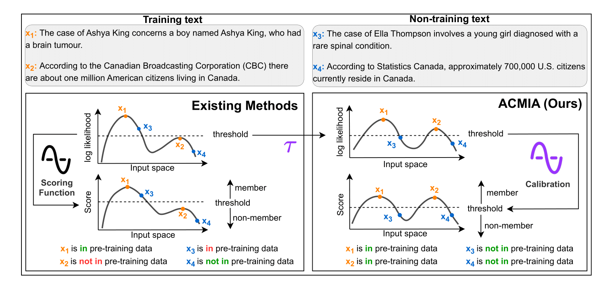

# Automatic Calibration for Membership Inference Attack on LLMs
This is the official repository for the paper Automatic Calibration for Membership Inference Attack on Large Language Models by Saleh Zare Zade, Yao Qiang, Xiangyu Zhou, Hui Zhu, Mohammad Amin Roshani, Prashant Khanduri, and Dongxiao Zhu.

## Overview
We propose ACMIA, a calibration-based framework for improving membership inference attacks (MIAs) on large language models (LLMs). Existing MIA methods often misclassify non-training texts as training data, especially when the texts are simple or share surface-level features with pre-training corpora. ACMIA addresses this issue by automatically calibrating token probabilities using a tunable temperature parameter, which refines the likelihood distribution without relying on additional reference models. This calibration is grounded in theoretical insights from maximum likelihood estimation and enhances the separation between member and non-member samples. We introduce three variants: AC, DerivAC, and NormAC, each capturing different aspects of model behavior and text complexity. To support evaluation, we benchmark ACMIA across three standard datasets: [WikiMIA](https://huggingface.co/datasets/swj0419/WikiMIA), [MIMIR](https://huggingface.co/datasets/iamgroot42/mimir), and [PatentMIA](https://github.com/zhang-wei-chao/DC-PDD).



## ACMIA (& baselines)
We first obtain the token log probability distribution by querying the LLM with the input text, and then compute the token log probability distributions under different temperature settings.
```
python src/com_pro_dis.py --tar_mod <model_name> --ref_dat <data_file> --data <data_file>
```
We then calibrate the token probabilities by focusing only on the first occurrence of each token in the sentence, and apply our three calibration methods (AC, DerivAC, and NormAC) to adjust the token log probabilities. A final detection score is computed based on these calibrated values to assess whether the input text was part of the pretraining data.
```
python src/Main_file.py --tar_mod <model_name> --data <data_file> --max_cha <text-length>
```
For the DC-PDD baseline, an additional reference dataset is required to compute token frequencies. Following their approach, we use a large-scale publicly available corpus as a proxy for estimating the token frequency distribution.
```
python src/com_fre_dis.py --model <model_name> --ref_dat <reference_dataset>
```

## HF paths of the evaluated model in the paper
- Pythia: [EleutherAI/pythia-70m](https://huggingface.co/EleutherAI/pythia-70m), [EleutherAI/pythia-160m](https://huggingface.co/EleutherAI/pythia-160m), [EleutherAI/pythia-1.4b](https://huggingface.co/EleutherAI/pythia-1.4b), [EleutherAI/pythia-2.8b](https://huggingface.co/EleutherAI/pythia-2.8b), [EleutherAI/pythia-6.9b](https://huggingface.co/EleutherAI/pythia-6.9b), [EleutherAI/pythia-12b](https://huggingface.co/EleutherAI/pythia-12b)
- GPT-NeoX: [EleutherAI/gpt-neox-20b](https://huggingface.co/EleutherAI/gpt-neox-20b)
- OPT: [facebook/opt-6.7b](https://huggingface.co/facebook/opt-6.7b)
- Qwen: [Qwen/Qwen1.5-0.5B](https://huggingface.co/Qwen/Qwen1.5-0.5B), [Qwen/Qwen1.5-1.8B](https://huggingface.co/Qwen/Qwen1.5-1.8B), [Qwen/Qwen1.5-4B](https://huggingface.co/Qwen/Qwen1.5-4B), [Qwen/Qwen1.5-7B](https://huggingface.co/Qwen/Qwen1.5-7B), [Qwen/Qwen1.5-14B](https://huggingface.co/Qwen/Qwen1.5-14B), [Qwen/Qwen1.5-32B](https://huggingface.co/Qwen/Qwen1.5-32B), [Qwen/Qwen1.5-72B](https://huggingface.co/Qwen/Qwen1.5-72B)
- Baichuan: [baichuan-inc/Baichuan-7B](https://huggingface.co/baichuan-inc/Baichuan-7B), [baichuan-inc/Baichuan-13B-Base](https://huggingface.co/baichuan-inc/Baichuan-13B-Base), [baichuan-inc/Baichuan2-7B-Base](https://huggingface.co/baichuan-inc/Baichuan2-7B-Base), [baichuan-inc/Baichuan2-13B-Base](https://huggingface.co/baichuan-inc/Baichuan2-13B-Base)

## Acknowledgement
This codebase is adapted from the [official repo](https://github.com/zhang-wei-chao/DC-PDD) of DC-PDD and PatentMIA.

## Citation
If you find this work helpful, please consider citing our paper:
```
@article{zade2025automatic,
  title={Automatic Calibration for Membership Inference Attack on Large Language Models},
  author={Zade, Saleh Zare and Qiang, Yao and Zhou, Xiangyu and Zhu, Hui and Roshani, Mohammad Amin and Khanduri, Prashant and Zhu, Dongxiao},
  journal={arXiv preprint arXiv:2505.03392},
  year={2025}
}
```
